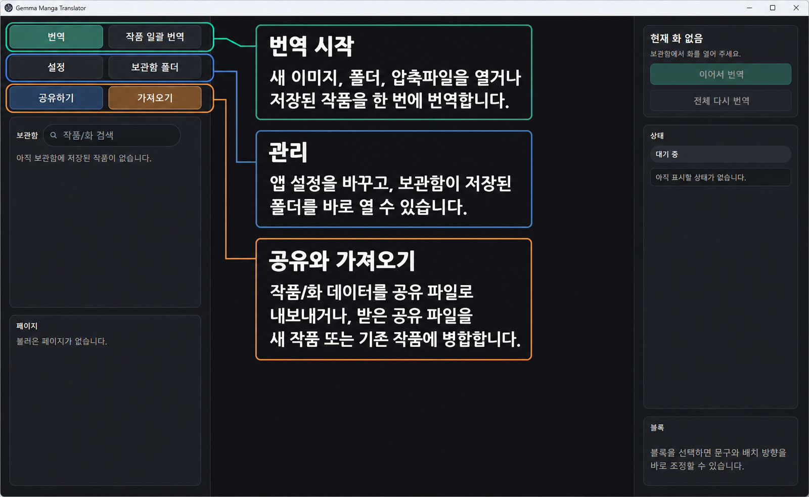
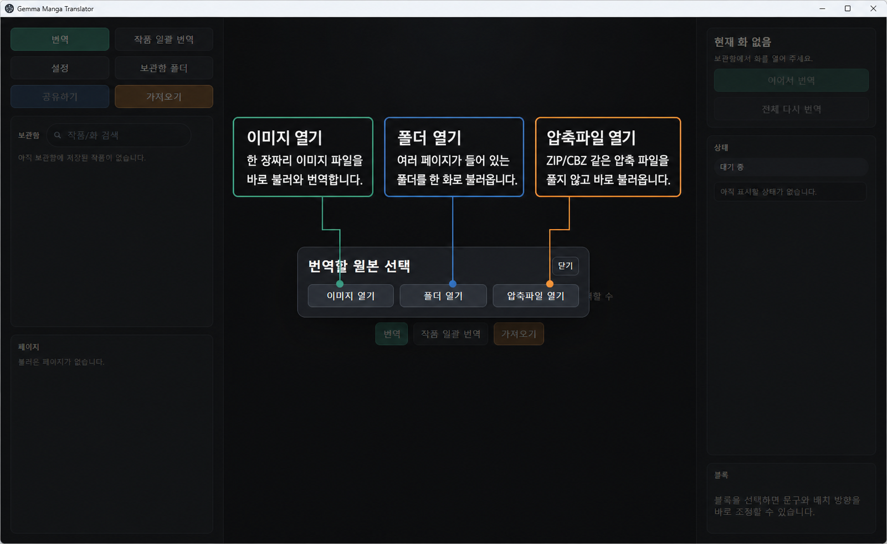
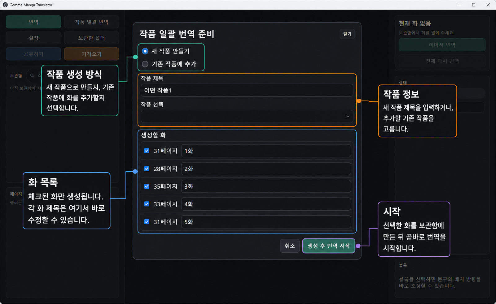
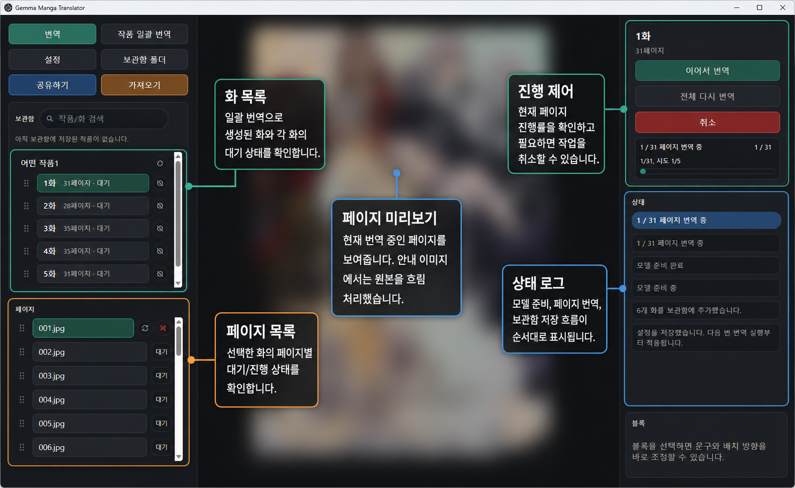
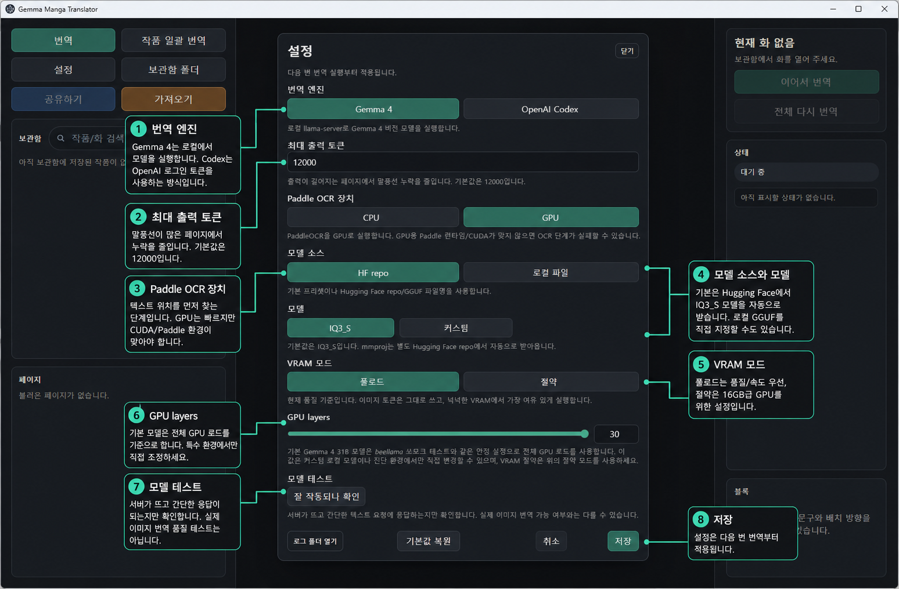
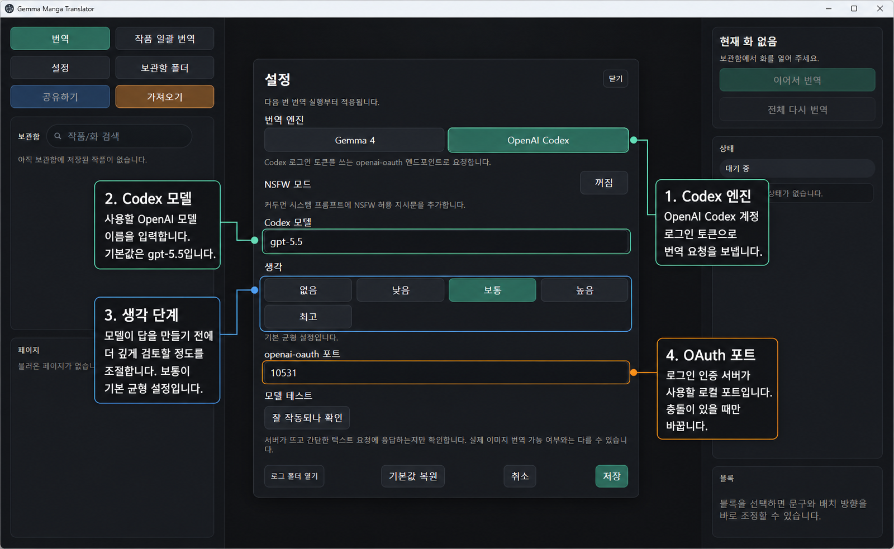
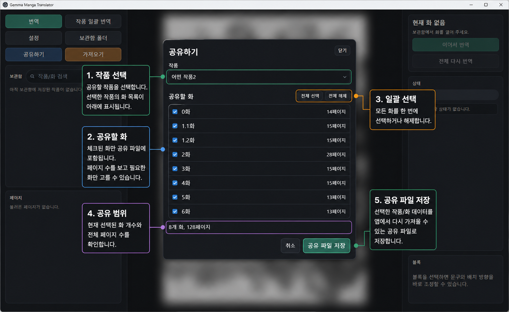
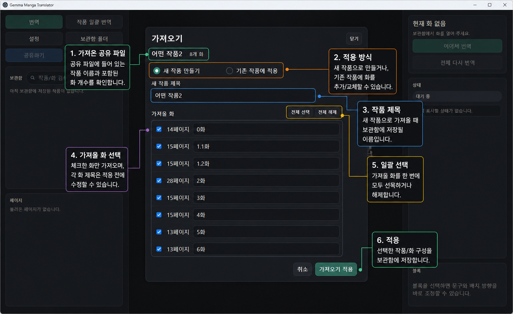
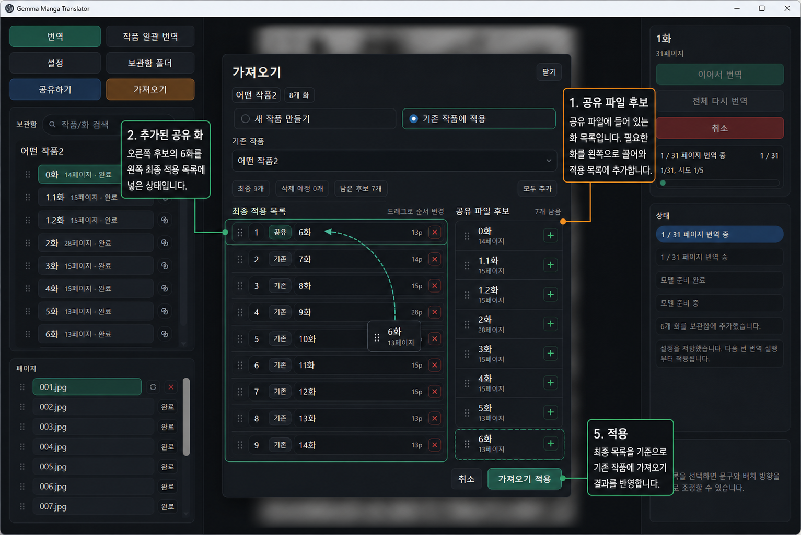

# 망가번역기

일본어 만화 이미지를 한국어로 가볍게 번역해 **감상용으로 읽기 편하게 만드는 Windows 데스크톱 앱**입니다.

이 앱은 전문 식질/역질 툴이 아닙니다. 원본 이미지를 지우고 새로 식자하는 방식이 아니라, 원본 페이지 위에 번역 텍스트 블록을 올려 빠르게 읽는 용도에 맞춰 만들었습니다. 말풍선 지우기, 배경 복원, 출판용 폰트 연출, 레이어 합성, 완성본 이미지/PDF 제작 같은 기능은 의도적으로 넣지 않았습니다.



## 주요 기능

- 이미지 한 장, 이미지 폴더, ZIP/CBZ 압축파일을 보관함에 추가
- 폴더/압축파일 여러 개를 작품의 여러 화로 읽어 일괄 번역
- `Gemma 4` 로컬 모델 또는 `OpenAI Codex` 기반 번역 엔진 선택
- 작품/화/페이지 단위 보관함 관리
- 번역 텍스트 블록 위치, 크기, 문장 수정
- 작품 데이터를 `*.mgtshare` 공유 파일로 내보내기
- 공유받은 작품/화를 새 작품으로 가져오거나 기존 작품에 병합

## 설치

일반 사용자는 GitHub Releases에서 Windows 설치 파일을 받아 실행하면 됩니다.

- Releases: https://github.com/ucx0204/Gemma4MangaTranslatorForKorean/releases
- 설치 파일 이름 예시: `망가번역기 Setup 0.3.1.exe`

개발 실행과 빌드 방법은 README 아래쪽의 [개발](#개발) 섹션에 따로 정리했습니다.

## 빠른 시작

1. 앱을 실행합니다.
2. `설정`에서 번역 엔진을 고릅니다.
3. `번역`을 눌러 이미지, 폴더, 압축파일 중 하나를 엽니다.
4. 새 작품으로 만들지, 기존 작품에 추가할지 선택합니다.
5. 보관함에 추가된 화를 열고 `이어서 번역` 또는 `전체 다시 번역`을 실행합니다.
6. 번역 결과가 어색하면 텍스트 블록과 문장만 가볍게 수정합니다.

## 번역할 원본 선택

`번역` 버튼을 누르면 번역할 원본을 고르는 창이 열립니다.



- `이미지 열기`: 한 장짜리 이미지 파일을 바로 불러옵니다.
- `폴더 열기`: 여러 페이지가 들어 있는 폴더를 한 화로 불러옵니다.
- `압축파일 열기`: ZIP/CBZ 같은 압축 파일을 풀지 않고 불러옵니다.

## 작품 일괄 번역

`작품 일괄 번역`은 여러 화를 한 번에 보관함에 만들고 곧바로 번역할 때 사용합니다. 폴더 안의 압축파일이나, 여러 페이지가 들어 있는 하위 폴더를 화 단위로 읽는 흐름에 맞춰져 있습니다.



체크된 화만 생성되며, 각 화 제목은 적용 전에 바로 수정할 수 있습니다. 새 작품을 만들거나 기존 작품에 이어 붙이는 방식도 선택할 수 있습니다.



번역 중에는 왼쪽에서 화/페이지별 상태를 확인하고, 오른쪽에서 현재 진행률과 로그를 볼 수 있습니다.

## 번역 엔진 설정

설정 변경은 다음 번 번역 실행부터 적용됩니다. 처음 쓰는 경우에는 PC 사양을 덜 타는 `OpenAI Codex`를 권장합니다.

### Gemma 4

`Gemma 4`는 내 PC에서 로컬 모델을 직접 실행합니다. 기본 프리셋은 beellama.cpp 기반 Gemma 4 31B IQ3_S 모델을 사용하며, 인터넷 없이 로컬에서 처리하고 싶거나 OpenAI 계정을 쓰지 않으려는 경우에 적합합니다. NVIDIA RTX GPU와 충분한 VRAM이 필요합니다.



- 모델 소스는 기본 Hugging Face repo 또는 직접 받은 GGUF 파일을 선택할 수 있습니다.
- `VRAM 모드`는 `풀로드`와 `절약` 중 선택합니다. 24GB 이상은 풀로드, 16GB급은 절약 모드를 권장합니다.
- 기본 Gemma 4 31B 프리셋은 스모크 테스트 기준으로 GPU 전체 로드를 사용합니다. `GPU Layers`는 커스텀 로컬 모델이나 진단용으로 남겨둔 값이며, 기본 프리셋의 VRAM 절약은 `VRAM 모드`로 조절하는 쪽이 맞습니다.
- `모델 테스트`는 서버가 간단한 요청에 응답하는지 확인하는 용도입니다. 실제 이미지 번역 품질을 보장하는 테스트는 아닙니다.

### OpenAI Codex

`OpenAI Codex`는 OpenAI 계정 로그인 토큰을 사용해 번역 요청을 보냅니다. 고성능 그래픽카드가 없어도 사용할 수 있습니다.



- 기본 모델은 `gpt-5.5`입니다.
- `생각` 단계는 모델이 답을 만들기 전에 더 깊게 검토할 정도를 조절합니다. 기본값은 `낮음`입니다.
- `openai-oauth 포트`는 로컬 로그인 인증 서버가 사용할 포트입니다. 다른 프로그램과 충돌할 때만 바꾸면 됩니다.

### Windows에서 Codex 연결하기

`OpenAI Codex` 엔진은 앱 안에 API 키를 붙여 넣는 방식이 아닙니다. Windows 사용자 계정에 저장된 Codex CLI 로그인 정보를 사용합니다.

1. Node.js LTS를 설치합니다: https://nodejs.org/
2. PowerShell을 새로 엽니다.
3. Codex CLI를 설치합니다.

```powershell
npm i -g @openai/codex
```

4. 로그인합니다.

```powershell
codex --login
```

5. 브라우저에서 OpenAI/ChatGPT 계정으로 로그인합니다.
6. 앱의 `설정`에서 `OpenAI Codex`를 선택하고 `잘 작동되나 확인`을 눌러 연결을 확인합니다.

전역 설치가 싫다면 아래처럼 한 번만 실행할 수도 있습니다.

```powershell
npx @openai/codex --login
```

## 공유하기

`공유하기`는 번역된 렌더 이미지가 아니라, 앱에서 다시 열 수 있는 작품 데이터 패키지를 만듭니다.



- 공유 파일 확장자는 `*.mgtshare`입니다.
- 선택한 작품과 화만 포함합니다.
- 원본 페이지 이미지, 번역 블록, 좌표, 스타일이 포함됩니다.
- 설정, 로그인 정보, 모델 파일, 로그, 임시 분석 파일은 포함하지 않습니다.

공유 파일에는 원본 페이지 이미지가 포함될 수 있으므로, 저작권이 있는 작품을 배포할 때는 주의해야 합니다.

## 가져오기

공유받은 `*.mgtshare` 파일은 새 작품으로 가져오거나 기존 작품에 적용할 수 있습니다.



새 작품으로 가져올 때는 작품 제목을 정하고, 가져올 화를 선택한 뒤 보관함에 저장합니다.



기존 작품에 적용할 때는 왼쪽의 `최종 적용 목록`과 오른쪽의 `공유 파일 후보`를 보면서 드래그로 화를 추가하고 순서를 조정합니다. 최종 적용 목록에 남아 있는 순서와 제목이 실제 보관함에 반영됩니다.

## 저장 위치

개발 실행에서는 프로젝트 폴더의 `library/`, `logs/`, `settings.json`을 사용합니다.

설치형 앱은 Windows 사용자 데이터 폴더를 사용합니다. 앱을 지웠다가 다시 설치해도 기본적으로 보관함과 모델 캐시가 남도록 하기 위해서입니다.

- 보관함: `%LOCALAPPDATA%\manga-gemma-translator\library`
- 로그: `%LOCALAPPDATA%\manga-gemma-translator\logs`
- 설정: `%LOCALAPPDATA%\manga-gemma-translator\settings.json`
- Gemma 모델 캐시: `%LOCALAPPDATA%\manga-gemma-translator\hf-cache`
- Paddle OCR 런타임: `%LOCALAPPDATA%\manga-gemma-translator\ocr-runtime`

예전 설치에서 실행 파일 옆 `data/` 폴더를 쓰고 있었다면, 새 버전 첫 실행 때 위 위치로 빠진 파일만 복사합니다. 이미 새 위치에 있는 파일은 덮어쓰지 않습니다.

앱을 제거할 때 언인스톨러의 `앱 데이터/모델/OCR 캐시까지 삭제` 옵션을 켜면 보관함, 설정, Gemma 모델 캐시, Paddle OCR 런타임 캐시까지 함께 삭제합니다. 보관함까지 지워지는 옵션이므로 기본값은 꺼져 있습니다.

## 의도적으로 하지 않는 일

이 앱의 목적은 “번역 오버레이로 읽기 편하게 감상하기”입니다. 아래 기능은 목표 범위가 아닙니다.

- 원문 글자를 자연스럽게 지우는 인페인팅
- 말풍선/배경 복원
- 출판용 식자, 폰트 연출, 레이어 합성
- 완성본 이미지/PDF 제작
- 전문 역식 워크플로우 관리

## 문제가 생겼을 때

먼저 설정에서 선택한 번역 엔진을 확인하세요.

- `OpenAI Codex`: PowerShell에서 `codex --login`을 다시 실행한 뒤 앱에서 `잘 작동되나 확인`을 누릅니다.
- `Gemma 4`: NVIDIA RTX GPU와 충분한 VRAM이 있는지 확인합니다.
- `openai-oauth 포트` 충돌이 의심되면 `10533`, `10534`, `10535` 같은 다른 값으로 바꿔 저장합니다.
- 큰 ZIP 파일이나 고해상도 이미지는 처리에 시간이 오래 걸릴 수 있습니다.
- 자세한 오류는 `설정`의 `로그 폴더 열기`에서 확인할 수 있습니다.

## 개발

일반 사용자는 이 섹션이 필요 없습니다. 앱을 직접 수정하거나 개발할 때만 사용합니다.

```powershell
npm install
npm run dev
```

## 빌드

```powershell
npm run build
```

## Windows 설치 파일 만들기

```powershell
npm run dist:win
```

설치 파일은 `dist/망가번역기 Setup <version>.exe`로 생성됩니다.

## 테스트

```powershell
npm run typecheck
npm test
```

## 라이선스

MIT License입니다. 자세한 내용은 [LICENSE](LICENSE)를 확인하세요.
