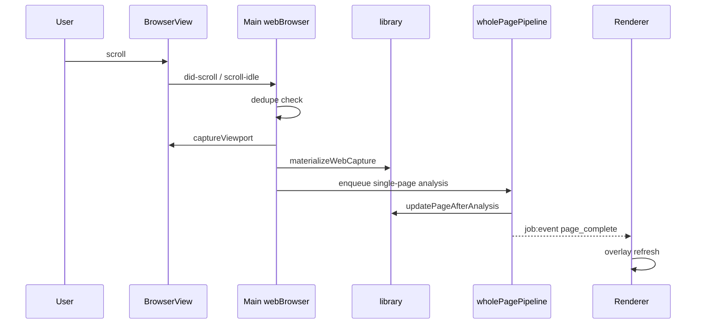

# 웹 페이지 번역 지원 기능 — 상세 구현 계획

> **문서 버전:** 0.2
> **작성일:** 2026-06-02  
> **최근 갱신:** 2026-06-03
> **대상 코드베이스:** Gemma4MangaTranslatorForKorean (Electron + React)  
> **목적:** 현재 로컬 파일(이미지/폴더/ZIP) 전용인 앱에 **웹 페이지 기반 만화/웹툰 읽기 + OCR/번역** 기능을 추가하기 위한 설계·로드맵

---

## 1. 배경 및 목표

### 1.1 현재 상태

앱은 다음 흐름으로 동작한다.

```
로컬 파일/ZIP import → library/ 디스크 저장 → main OCR+Gemma 파이프라인 → renderer 오버레이 편집
```

- **입력:** 이미지 파일, 폴더, ZIP/CBZ (`ImportSourceKind`: `images | folder | zip | zip-folder`)
- **저장:** `library/works/{workId}/chapters/{chapterId}/pages/` 아래 PNG/WebP
- **표시:** `ImageStage` + `OverlayBlock` (정규화 bbox 오버레이)
- **번역:** `job:start-analysis` → `runWholePagePipeline` (화 단위 배치, `runMode`: `pending | all | single-page`)
- **제약:** 동시 active job 1개 (`ActiveJobStore`), 이미지는 `mgt-image://` 프로토콜 + library 샌드박스 내만 허용

웹 URL, 스크롤 뷰어, 실시간 페이지별 처리에 대한 코드는 **존재하지 않는다**.

### 1.2 추가하려는 기능

| 요구 | 설명 |
|------|------|
| **웹 페이지 입력** | URL을 열어 온라인 만화/웹툰 사이트에서 직접 작업 |
| **스크롤 대응** | 세로 스크롤(웹툰), 가로 페이지 넘김, 무한 스크롤 등 레이아웃별 캡처 |
| **실시간성** | 사용자가 읽는 속도에 맞춰 **한 페이지(뷰포트/세그먼트)씩** OCR → 번역 → 오버레이 표시 |
| **기존 UX 재사용** | 블록 편집, 저장, 공유(`.mgtshare`) 등 로컬 화와 동일한 데이터 모델 유지 |

### 1.3 비목표 (1차 릴리스)

- 웹사이트별 완전 자동 DOM 파싱(모든 사이트 범용 크롤러)
- 브라우저 확장 프로그램 단독 배포
- 웹 페이지 인페인팅(Flux) 실시간 연동 — 2차 이후 검토
- DRM/유료 구독 사이트 우회

---

## 2. 설계 원칙

1. **Library-first:** 웹에서 캡처한 이미지도 반드시 `library/` 아래 materialize한다. 기존 `assertLibraryImagePath`, `mgt-image://`, OCR/번역 파이프라인을 그대로 재사용한다.
2. **Main에서 캡처, Renderer에서 편집:** ML·네트워크·브라우저 엔진은 main process; renderer는 기존 `ChapterSnapshot` + `ImageStage` 유지.
3. **점진적 확장:** 1) URL + 수동 캡처 → 2) 스크롤 연동 → 3) 실시간 자동 번역 → 4) 사이트 프리셋 순으로 단계적 출시.
4. **실패 허용:** 사이트마다 DOM/이미지 로딩 방식이 다르므로, **범용 캡처(스크린샷)** 를 기본으로 하고 사이트별 어댑터는 옵션으로 추가한다.
5. **MVP 최소화:** 1차 목표는 "웹 URL 로드 → 현재 화면 수동 캡처 → library page append → 기존 single-page 번역"까지로 제한한다. 세션 복원, 자동 스크롤, 사이트 프리셋, 라이브 큐는 이후 단계에서 붙인다.
6. **IPC strict schema 동시 갱신:** `src/shared/types.ts`만 바꾸지 않는다. `src/shared/ipcSchemas.ts`가 `.strict()` 기반이므로 `web`, `webMeta`, `webOrigin` 같은 신규 필드는 Zod schema까지 같은 커밋에서 반영한다.

---

## 3. 아키텍처 옵션 비교

### 옵션 A — Embedded Browser + 캡처 → Library (권장)

```
[BrowserView/WebContentsView]  ← main이 URL 로드
        │ capturePageSegment()
        ▼
[materializeWebPage] → library/pages/NNN.png
        │
        ▼
[runWholePagePipeline single-page] → blocks → renderer overlay
```

| 장점 | 단점 |
|------|------|
| 기존 library/OCR/번역 100% 재사용 | BrowserView UI/포커스/보안 설계 필요 |
| 로그인·쿠키·JS 렌더링 지원 | 캡처 해상도·스크롤 동기화 난이도 |
| Electron 네이티브 기능 활용 | 앱 창 레이아웃 변경 |

### 옵션 B — 외부 브라우저 + 확장/클립보드 수신

앱이 이미지 paste/DnD만 받고, 사용자는 Chrome 확장으로 캡처.

| 장점 | 단점 |
|------|------|
| 앱 변경 최소 | 별도 확장 배포·유지보수 |
| 사이트 호환성 높음 | 실시간 UX 끊김, 통합 UX 약함 |

### 옵션 C — URL에서 이미지 URL만 fetch (정적 갤러리형)

`` 목록을 추출해 HTTP 다운로드.

| 장점 | 단점 |
|------|------|
| 구현 단순 | Canvas/WebP blob, lazy load, DRM 사이트 불가 |
| | 스크롤형 웹툰 대응 불가 |

**결론: 옵션 A를 1차 목표로 채택.** 옵션 C는 특정 사이트 프리셋의 보조 수단으로 3차에 추가.

---

## 4. 목표 사용자 시나리오

### 시나리오 1 — 세로 스크롤 웹툰 (실시간)

1. 사용자가 `웹에서 열기` → URL 입력
2. 앱 하단/좌측에 브라우저 패널, 우측/상단에 번역 오버레이 패널 (split view)
3. 사용자가 스크롤 → **스크롤 정지 300ms 후** 현재 뷰포트 캡처
4. 캡처가 새 세그먼트면 library page 추가 + `single-page` 번역 job 자동 시작
5. 번역 완료 시 해당 세그먼트 위에 오버레이 표시 (읽으면서 아래로 스크롤)

### 시나리오 2 — 가로 페이지 넘김 (만화 뷰어)

1. 사이트의 `다음` 버튼 또는 ←/→ 키로 페이지 전환
2. 전환 감지 시 **전체 뷰포트** 또는 **`.viewer img` 영역** 캡처
3. chapter pageOrder에 순서대로 append + 번역

### 시나리오 3 — 배치 import (비실시간)

1. URL + "전체 캡처" 모드: 자동 스크롤하면서 N장 캡처 후 일괄 번역
2. 기존 `이어서 번역` / `전체 다시 번역` UX와 동일하게 동작

---

## 5. 데이터 모델 확장

### 5.1 ImportSourceKind 확장

```typescript
// src/shared/types.ts
export type ImportSourceKind =
  | "images" | "folder" | "zip" | "zip-folder"
  | "web";  // 신규

export type WebPageSourceMeta = {
  url: string;                    // 최초 진입 URL
  finalUrl?: string;              // 리다이렉트 후 URL
  segmentIndex: number;           // 0-based 캡처 순서
  scrollY?: number;               // 캡처 시 scrollY (중복 방지)
  viewport: { width: number; height: number; deviceScaleFactor: number };
  captureMode: "viewport" | "element" | "full-page";
  captureRectCss?: { x: number; y: number; width: number; height: number };
  captureRectDevicePx?: { x: number; y: number; width: number; height: number };
  pageScaleFactor?: number;
  overlapWithPreviousPx?: number;
  capturedAt: string;             // ISO timestamp
  contentHash?: string;           // perceptual hash / sha256 (중복 skip)
  dedupeReason?: string;          // skip/debug 판단 근거
  sitePresetId?: string;          // 적용된 사이트 프리셋
};
```

### 5.2 LibraryPageRecord 확장 (선택 필드)

```typescript
export type LibraryPageRecord = Omit<MangaPage, "dataUrl"> & {
  webMeta?: WebPageSourceMeta;
};
```

- `imagePath`는 기존과 동일 (`pages/001-{id}.png`)
- 공유(`.mgtshare`) 시 `webMeta` 포함 여부는 설정으로 선택 (기본: URL만, 스크린샷은 항상 포함)

### 5.3 WebSession (main memory + optional disk)

브라우저 세션 상태. library chapter와 1:1 또는 N:1 매핑.

```typescript
export type WebBrowseSession = {
  sessionId: string;
  chapterId: string;              // materialize 대상 chapter
  browserViewId: string;
  startUrl: string;
  mode: "live" | "batch" | "manual";
  autoTranslate: boolean;
  lastCaptureHash?: string;
  lastScrollY?: number;
  segmentCount: number;
  createdAt: string;
};
```

저장 위치: `library/works/{workId}/chapters/{chapterId}/web-session.json` (앱 재시작 복원용)

### 5.4 Chapter 메타

```typescript
export type LibraryChapter = {
  // ...
  sourceKind: ImportSourceKind;   // "web"
  webOrigin?: {
    startUrl: string;
    finalUrl?: string;
    title?: string;
    sitePresetId?: string;
    createdFrom: "manual-capture" | "live-capture" | "batch-capture";
  };
};
```

### 5.5 Zod schema 변경 필수

현재 IPC schema는 `.strict()`를 사용한다. 따라서 타입만 확장하면 renderer/main 왕복 저장에서 신규 필드가 거부된다.

변경 대상:

- `ImportSourceKindSchema`: `"web"` 추가
- `MangaPageSchema`: `webMeta?: WebPageSourceMetaSchema` 추가
- `ChapterSnapshotSchema`: `webOrigin?: WebOriginSchema` 추가
- `SaveMangaPageSchema`, `SaveChapterSnapshotSchema`: 저장 시에도 web 필드를 허용

완료 기준:

- `sourceKind: "web"` chapter를 `openChapter → saveChapterSnapshot → openChapter`로 왕복해도 `webMeta`, `webOrigin`이 유지된다.

---

## 6. 핵심 모듈 설계

### 6.1 Main — `webBrowser/` (신규)

| 파일 | 책임 |
|------|------|
| `webBrowserManager.ts` | BrowserView/WebContentsView 생성·attach·destroy, 세션 CRUD |
| `webCapture.ts` | `captureViewport`, `captureElement`, `captureFullPage` (CDP `Page.captureScreenshot`) |
| `webScroll.ts` | 프로그래매틱 스크롤 (배치), scroll idle 감지 |
| `webSitePresets.ts` | 사이트별 selector, scroll step, next button (optional) |
| `webMaterialize.ts` | 캡처 Buffer → `materializePageRecord` 래퍼 |
| `webSessionStore.ts` | 세션 영속화, TTL, 중복 hash 관리 |

**BrowserView 배치 (Electron 39 기준):**

- `WebContentsView` 우선 검토 (최신 API, BrowserView deprecated 추세)
- Main window content 영역에 attach; renderer React와 **별도 native view**이므로 bounds는 IPC로 동기화

### 6.2 Main — `library.ts` 확장

```typescript
async function appendWebCapturePage(input: {
  chapterId: string;
  imageBuffer: Buffer;
  extension?: ".png" | ".jpg" | ".webp";
  webMeta: WebPageSourceMeta;
  pageName?: string;
}): Promise<ChapterSnapshot>
```

- 기존 `materializePageRecord` 패턴 재사용 (이미지 write, width/height probe)
- `pageOrder` append + `chapter.json` atomic update (`AsyncMutex`)
- `work.updatedAt`도 같이 갱신
- 저장 파일명: `pages/{NNN}-{pageId}.png`
- 반환값은 renderer가 바로 merge할 수 있도록 `ChapterSnapshot`

추가로 빈 web chapter 생성을 위한 API가 필요하다.

```typescript
async function createWebChapter(input: {
  target: ImportTarget;
  title: string;
  startUrl: string;
  finalUrl?: string;
}): Promise<ChapterSnapshot>
```

MVP에서는 URL 입력 직후 빈 chapter를 만들고, 첫 캡처부터 `appendWebCapturePage`로 page를 추가한다.

### 6.3 Main — 실시간 번역 오케스트레이션

현재 `ActiveJobStore`는 **동시 1 job**. 실시간 모드 대응:

| 전략 | 설명 | 권장 |
|------|------|------|
| **Queue + coalesce** | 새 캡처마다 queue에 넣되, 처리 중이면 최신 1건만 유지 | 1차 |
| **Dedicated live job** | `kind: "web-live-analysis"` 별도, 내부에서 single-page 연속 처리 | 2차 |
| **Cancel & restart** | 스크롤마다 이전 job cancel → 새 page | UX 나쁨, 비권장 |

**1차 구현 (Queue):**

```
capture → enqueue(pageId)
worker: while queue not empty
  dequeue → runWholePagePipeline([single page])
  emit job:event → renderer refresh page blocks
```

- `runMode: "single-page"` + `pageId` 기존 API 재사용
- OCR hints 캐시: `runs/{jobId}/ocr-hints-{pageId}.json` (페이지별)

단, renderer가 캡처마다 `job:start-analysis`를 직접 반복 호출하면 현재 `ActiveJobStore`의 "동시 active job 1개" 제한에 걸릴 수 있다. Phase 2부터는 main process에 `webLiveQueue`를 두고, 큐 worker만 `ActiveJobStore`를 점유한다.

```text
renderer: capture/autoTranslate 설정만 요청
main: webLiveQueue.enqueue(pageId)
worker: ActiveJobStore가 비어 있을 때만 다음 page 처리
```

또한 현재 `runWholePagePipeline`은 호출마다 endpoint session을 시작한다. live 모드에서 페이지마다 서버 boot를 반복하면 UX가 크게 느려질 수 있으므로 단계별로 나눈다.

| 단계 | 런타임 전략 |
|------|-------------|
| Phase 1 | 기존 `job:start-analysis` single-page 호출 재사용 |
| Phase 2 | `web-live-analysis` worker 도입, queue 직렬 처리 |
| Phase 2.5 | endpoint session 재사용 검토 (`runWholePagePipeline` 내부 분리 또는 별도 page runner) |

**프리페치 (2차):**

- 현재 페이지 번역 중, **다음 viewport 캡처만** 미리 materialize (번역은 하지 않음)
- 사용자가 스크롤 시 대기 시간 단축

### 6.4 Renderer — UI 컴포넌트

| 컴포넌트 | 역할 |
|----------|------|
| `WebBrowseModal` / `WebBrowsePanel` | URL 입력, 모드 선택 (실시간/수동/배치) |
| `WebBrowseLayout` | Split: browser bounds + overlay stage |
| `WebBrowseToolbar` | 캡처, 자동번역 토글, 스크롤 step, 사이트 프리셋 |
| `WebLiveStatusBar` | 현재 segment, queue depth, 번역 중 표시 |

**기존 재사용:**

- `ImageStage`, `OverlayBlock`, `EditorPanel`, `useChapterPersistence`
- `useJobEvents` — web live job도 `job:event` 동일 채널
- `pageNavigation.ts` — web segment ↔ pageOrder 매핑 시 `resolveAdjacentPageId` 재사용

### 6.5 Browser bounds 동기화

Renderer resize/layout 변경 시 main BrowserView bounds 업데이트:

```
renderer: ResizeObserver → IPC web:sync-bounds { x, y, width, height }
main: webBrowserManager.setBounds(sessionId, rect)
```

- DPI scaling: `deviceScaleFactor` 반영
- DevTools/모달 열림 시 browser panel hide 또는 bounds 0

---

## 7. IPC 설계

### 7.1 Preload API (`mangaApi` 확장)

| 메서드 | 설명 |
|--------|------|
| `openWebBrowse(request)` | URL + mode → sessionId, chapterId, openedChapter 반환 |
| `closeWebBrowse(sessionId)` | BrowserView destroy, 세션 정리 |
| `captureWebSegment(sessionId, options?)` | 수동 캡처 → pageId |
| `setWebAutoTranslate(sessionId, enabled)` | 실시간 토글 |
| `syncWebBrowserBounds(sessionId, rect)` | layout sync |
| `scrollWebBrowser(sessionId, deltaY)` | 프로그래매틱 스croll (배치용) |
| `getWebBrowseState(sessionId)` | segmentCount, queue, currentUrl |

### 7.2 Push 이벤트

| 채널 | payload |
|------|---------|
| `web:segment-captured` | `{ sessionId, pageId, segmentIndex, thumbnailUrl? }` |
| `web:navigation` | `{ sessionId, url, title }` |
| `web:scroll-idle` | `{ sessionId, scrollY }` — live mode 트리거 |
| `job:event` | 기존과 동일 (pageIndex, phase 등) |

### 7.3 Zod 스키마

`src/shared/ipcSchemas.ts`에 `OpenWebBrowseRequestSchema`, `WebBrowseBoundsSchema` 추가.

---

## 8. 스크롤·페이지 넘김 대응 상세

### 8.1 캡처 모드

| 모드 | API | 용도 |
|------|-----|------|
| **viewport** | CDP screenshot (clip 없음) | 기본, 대부분 웹툰 |
| **element** | selector bounding box clip | `.viewer`, `#content` 등 |
| **full-page** | CDP `Page.captureScreenshot({ captureBeyondViewport: true })` | 전체 스크롤 번역, 중간 길이 웹툰 |

### 8.1.1 viewport 경계 문제

단순 viewport 캡처는 말풍선이나 세로 텍스트가 캡처 경계에 걸릴 수 있다. 이 경우 OCR bbox가 잘리거나 동일 말풍선이 다음 segment와 중복 번역될 수 있다.

MVP 기본값:

- 캡처 간 10-20% overlap 유지
- 상단/하단 edge zone에 걸친 OCR bbox는 warning 표시 또는 다음 segment와 중복 판단
- fixed header/footer가 있는 사이트를 위해 crop margin 옵션 제공
- 가능하면 viewport보다 `element` 또는 이미지 단위 캡처를 우선 사용

Phase 1.5에서 최소 generic selector preset을 추가한다.

### 8.1.2 full-page 전체 스크롤 캡처

긴 스크롤 웹툰에서 viewport 캡처를 여러 페이지로 저장하면, 사용자가 다시 위로 스크롤했을 때 이전 번역이 즉시 보이지 않는다. 이를 줄이기 위해 `captureMode: "full-page"`를 지원한다.

- 캡처 전 웹 번역 오버레이를 숨겨 원본 웹만 캡처한다.
- `position: fixed` / `sticky` 요소 중 viewport 가장자리에 붙은 후보를 임시로 `visibility: hidden` 처리해 고정 헤더/푸터 반복을 줄인다.
- lazy-loading 이미지를 위해 전체 페이지를 짧게 자동 스크롤한 뒤 원래 위치로 복귀한다.
- 32,000px 이하의 캡처 이미지는 하나의 web page로 materialize하고, `webMeta.viewport`에는 전체 문서 CSS 크기를 저장한다.
- 오버레이는 viewport scroll 좌표가 아니라 문서 전체 좌표에 주입하므로, 다시 스크롤해도 같은 웹 페이지 위에서 번역 블록이 유지된다.
- 32,000px를 넘는 초대형 페이지는 오버랩 viewport 타일로 캡처한 뒤 겹친 상단을 잘라 하나의 `web-full-###.png`로 저장한다. OCR은 이 거대 PNG를 직접 읽지 않고, `webMeta.ocrTiles`에 저장된 보조 타일 PNG들을 배치 OCR한 뒤 bbox를 전체 이미지 좌표로 보정한다.

현재 안전 장치:

- 단일 full-page 캡처는 OCR/OpenCV/Pillow 안정성을 위해 32,000px 이하에서만 사용한다.
- 32,000px 초과 페이지는 하나의 보관함 페이지로 저장하되 OCR만 내부 타일 배치로 처리한다. OCR batch size 설정은 이 OCR 타일들에 그대로 적용된다.

### 8.1.3 초대형 페이지 타일 처리 설계

full-page 단일 PNG가 너무 큰 경우에는 다음 방식으로 확장한다.

1. 문서 높이를 viewport 단위 tile로 나누고 약 25%, 최대 360px overlap을 둔다.
2. 각 tile은 원본 웹 오버레이를 숨긴 상태에서 캡처한다. fixed/sticky 요소를 강제로 숨기면 일부 사이트에서 레이아웃이 잘리는 문제가 있어, 현재는 overlap crop으로 반복 영역을 줄인다.
3. OCR/번역은 tile 단위로 실행한다. 이때 LLM에는 전체 초대형 이미지를 보내지 않는다.
4. tile-local bbox는 각 OCR tile의 `x/y/width/height`를 이용해 전체 PNG의 0-1000 좌표로 변환한다.
5. overlap을 도입하는 후속 단계에서는 bbox IoU, source text, 중심점 거리로 중복 블록을 제거한다.
6. 현재 구현은 물리 저장은 하나의 full-page PNG로 유지하고, OCR용 타일 PNG는 페이지 보조 디렉터리에 저장한다. 긴 페이지 번역은 `ocr-text` 모드로 강제해 거대 이미지를 LLM에 보내지 않는다.

2026-06-03 구현 메모: `captureMode: "full-page"`에서 문서 높이가 32,000px를 넘으면 overlap tile capture → cropped stitch PNG 생성 → `webMeta.ocrTiles` 배치 OCR → 전체 좌표 bbox 병합 순서로 처리한다.

```typescript
type GenericCapturePreset = {
  viewerSelector?: string;       // 예: main, article, .viewer
  imageSelector?: string;        // 예: .viewer img
  excludeFixedSelectors?: string[];
};
```

### 8.2 중복 방지

스크롤 bounce/미세 움직임으로 동일 화면이 여러 번 캡처되는 것 방지:

1. `scroll idle` debounce 300–500ms
2. `scrollY` 변화량 < viewport 높이의 15% → skip
3. 캡처 이미지 **dHash/perceptual hash** — 이전 hash와 Hamming distance < threshold → skip
4. (옵션) 사이트 프리셋 `minScrollStepPx`

### 8.3 세로 스크롤 웹툰 (live)



### 8.4 가로 페이지 넘김

1. **프리셋 방식:** `nextButtonSelector` 클릭 감지 (`dom-ready` + mutation observer via preload script injection — **주의: isolated world**)
2. **범용 방식:** 사용자 `→` 키 또는 toolbar `다음 페이지 캡처` 버튼
3. **CDP `Page.getLayoutMetrics`** 로 scroll width 변화 감지 (가로 스크롤 사이트)

**Preload injection 대안 (보안):**

- BrowserView 전용 **preload script** (`web-browser-preload.js`): scroll/click 이벤트만 main으로 postMessage
- `contextIsolation: true` 유지, nodeIntegration false

### 8.5 배치 자동 스크롤

```
while segmentCount < maxSegments:
  capture → materialize
  scrollBy(viewportHeight * 0.9)
  wait scroll idle + image lazy-load delay (sitePreset.imageLoadWaitMs)
```

- lazy-load: `networkIdle` 또는 preset wait
- 최대 segment 수·최대 chapter page 수 cap (예: 500)

---

## 9. 실시간 번역 UX

### 9.1 상태 머신 (Web Live Session)

```
idle → browsing → capturing → queued → translating → overlay_ready → browsing
                      ↑___________________________________|
```

### 9.2 UI 표시

| 상태 | 사용자 피드백 |
|------|----------------|
| capturing | browser panel 하단 얇은 progress |
| translating | overlay panel에 skeleton / "번역 중…" |
| overlay_ready | 기존 `ImageStage` 오버레이 (browser 위가 아닌 **캡처본** 위) |
| failed | page `lastError` + 재시도 버튼 |

### 9.3 Split View 레이아웃 (권장)

```
┌─────────────────────────────────────────────────────────┐
│ Toolbar: URL | 실시간 ON/OFF | 캡처 | ← segment →      │
├──────────────────────────┬──────────────────────────────┤
│                          │                              │
│   BrowserView (원본)      │   ImageStage (캡처 + overlay) │
│   사용자가 스크롤/읽기      │   번역 결과 확인·편집          │
│                          │                              │
└──────────────────────────┴──────────────────────────────┘
```

- **왼쪽:** live web (스크롤)
- **오른쪽:** 마지막 캡처 segment의 번역 결과 (또는 segment 선택 시 해당 page)

대안: **오버레이-only 모드** — browser fullscreen + 캡처본을 반투명 overlay로 browser 위에 absolute (기술 난이도 높음, 2차)

### 9.4 segment ↔ page 선택 동기화

- `selectedPageId` 변경 시 오른쪽 `ImageStage` 전환
- browser scroll position을 과거 segment로 **되돌리기**는 optional (scroll restore는 2차)

---

## 10. 사이트 프리셋 (3차)

`webSitePresets.ts` 예시:

```typescript
export type WebSitePreset = {
  id: string;
  label: string;
  urlPattern: RegExp;
  viewerSelector?: string;
  nextButtonSelector?: string;
  scrollDirection: "vertical" | "horizontal";
  imageLoadWaitMs: number;
  captureMode: "viewport" | "element";
  batchScrollStepRatio: number;  // 0.9 = 90% viewport
};
```

초기 내장 프리셋 후보 (사용자 요청·테스트 기반):

- 일반 이미지 태그 나열형
- 세로 스크롤 웹툰 (연속 canvas/img)
- 가로 페이지 (single image viewer)

**범용 default preset** 1개만으로 1·2차 릴리스 가능.

---

## 11. 보안·정책

### 11.1 BrowserView 보안

- `sandbox: true`, `nodeIntegration: false`, `contextIsolation: true`
- `webSecurity: true` (기본)
- 앱 본문 renderer와 분리된 session partition 사용
- `permissionRequestHandler`로 camera/mic/geolocation/notifications 기본 차단
- 허용 URL: 사용자 입력 + optional allowlist 설정
- `will-navigate` / `setWindowOpenHandler` 로 의도치 않은 팝업 제어
- 다운로드는 기본 차단 또는 사용자 확인 후 저장
- `file://`, 커스텀 프로토콜, 외부 앱 protocol navigation 정책 명시
- 로그인 쿠키 저장 여부는 사용자 설정으로 분리

### 11.2 Renderer CSP

현재 `index.html` CSP는 `img-src 'self' data: blob: file: mgt-image:`.

- BrowserView는 **별도 webContents** → 앱 CSP와 분리 (외부 사이트 로드 가능)
- 캡처 결과는 library materialize → `mgt-image://` (변경 불필요)

### 11.3 법적·윤리 고지

- UI에 **"저작권이 있는 콘텐츠의 무단 복제·배포 금지"** 고지
- `.mgtshare` export 시 web URL 메타 포함 여부 경고
- 앱은 **개인 감상용 번역 오버레이** 목적 유지 (README 비목표와 일치)

---

## 12. 기존 코드 영향도

| 영역 | 변경 수준 | 내용 |
|------|-----------|------|
| `src/shared/types.ts` | 중 | `ImportSourceKind`, `webMeta`, WebSession 타입 |
| `src/shared/ipcSchemas.ts` | 중 | web IPC 스키마 |
| `src/main/library.ts` | 중 | `materializeWebCapture`, chapter web origin |
| `src/main/ipc/` | 대 | `webBrowseIpc.ts` 신규, `registerIpc.ts` |
| `src/main/wholePagePipeline.ts` | 소 | single-page queue 호출 (기존 로직 재사용) |
| `src/preload/index.ts` | 중 | mangaApi web 메서드 |
| `src/renderer/App.tsx` | 중 | web session state, layout mode |
| `src/renderer/components/` | 대 | WebBrowse* 컴포넌트 |
| `ImageStage`, `OverlayBlock` | **없음~소** | 재사용 |
| `translationJobIpc.ts` | 소 | live queue wrapper (optional) |
| `electron-builder.config.cjs` | 소 | web preload 번들 포함 |

---

## 13. 구현 단계 (로드맵)

### Phase 0 — 사전 작업 / POC (1주)

- [x] WebContentsView POC: URL 로드 + 수동 screenshot buffer 확보
- [x] `createWebChapter` + `appendWebCapturePage` prototype
- [x] `ImportSourceKind: "web"` + `webMeta` + `webOrigin` 타입/Zod schema 반영
- [x] 수동 캡처 → library page append → `openChapter`/`getPageImageDataUrl` 확인
- [ ] local HTML fixture server 준비 (`webtoon-scroll.html`, `horizontal-viewer.html`, `lazy-images.html`)

**완료 기준:** 임의 URL에서 수동 버튼 1회 → library page 생성 → 기존 `ImageStage`에서 캡처본 표시

### Phase 1 — MVP: 수동 웹 캡처 + 번역 (2–3주)

- [x] `WebBrowseModal`: URL 입력 → web chapter 생성
- [x] Toolbar `현재 화면 캡처` → materialize
- [x] 캡처 후 번역 토글 → 기존 `job:start-analysis` single-page 재사용
- [x] 최소 Split view (browser + ImageStage)
- [x] Library tree에 `sourceKind: web` 표시
- [x] IPC + 스키마 + 테스트 (schema round-trip)
- [ ] library append web page integration test
- [ ] capture 실패/translation 실패 시 page `lastError` 표시

**명시적 제외:** 세션 복원, 자동 스크롤, live queue, 사이트 프리셋 UI

**완료 기준:** 사용자가 웹툰 URL을 열고, 스크롤 후 수동 캡처·번역·편집·저장 가능

#### 2026-06-02 구현 메모

- Main process에 `WebBrowserManager`와 `web:*` IPC를 추가했다. Electron 39 기준 `WebContentsView`를 사용하며, 외부 사이트는 앱 renderer와 분리된 `persist:mgt-web-{sessionId}` partition에서 열린다.
- 현재 보안 정책은 `http:`/`https:` URL만 허용하고, 팝업·카메라·마이크·위치 등 권한 요청은 기본 차단한다.
- MVP 캡처는 `captureMode: "viewport"`를 기본으로 한다. 2026-06-03에 `full-page` 전체 스크롤 캡처를 추가했다. `element` 타입과 schema는 후속 구현을 위해 남겨두되, main에서는 아직 요청을 거부한다.
- 캡처 이미지는 즉시 `library/.../pages/` 아래 PNG로 저장되고, `MangaPage.webMeta`에 URL, scrollY, viewport, capture hash, segmentIndex가 기록된다.
- URL 입력 직후 빈 web chapter를 만들고 `LibraryChapter.webOrigin`에 시작 URL/최종 URL/title을 저장한다.
- renderer는 split view를 사용한다. 왼쪽은 native browser bounds host, 오른쪽은 기존 `ImageStage` 기반 캡처/번역 편집 화면이다.
- React 모달이 열릴 때 native browser가 모달 위를 덮지 않도록 bounds를 `0x0`으로 숨긴다.
- "캡처 후 번역"은 Phase 1용 단순 연결로, renderer에서 캡처 성공 후 기존 `startAnalysis({ runMode: "single-page" })`를 호출한다. Phase 2의 live queue가 들어오면 main worker 방식으로 이동한다.
- 웹 세션은 아직 메모리 전용이다. 앱 재시작 후에는 캡처된 web chapter를 일반 library chapter처럼 다시 열 수 있으나, 브라우저 세션 복원은 Phase 2 이후 과제로 유지한다.
- 웹 세션을 열면 `TranslationWarmupManager`가 백그라운드에서 Gemma endpoint와 Paddle OCR 런타임/모델 캐시를 미리 준비한다. 번역 job이 먼저 시작되면 진행 중인 warm-up을 기다린 뒤 기존 pipeline이 `reuseServer`로 endpoint를 재사용한다.
- OCR 기본 엔진은 PP-OCRv5로 변경했다. v5 선택 시 사전 다운로드 대상도 PP-OCRv5 det/rec 모델로 제한해 PaddleOCR-VL 모델까지 불필요하게 준비하지 않는다.
- Paddle OCR warm-up은 이제 패키지/모델 캐시 준비 후 `paddleocr-vl-bboxes.py --serve` 워커를 띄워 Python OCR 프로세스와 Paddle 모델 객체를 유지한다. 이후 OCR 배치는 같은 워커에 JSONL 요청을 보내며, `MANGA_TRANSLATOR_DISABLE_OCR_WORKER=1` 설정 시 기존처럼 배치마다 프로세스를 실행한다.
- `전체 스크롤 번역` 버튼은 `captureMode: "full-page"`로 캡처 후 기존 single-page 분석 파이프라인을 재사용한다. full-page 오버레이는 문서 전체 좌표로 주입하고 렌더링 시 `window.scrollTo`를 강제하지 않는다.
- full-page 캡처 전에는 웹 번역 오버레이와 fixed/sticky edge 요소를 임시로 숨기고, lazy-loading 이미지를 깨우기 위해 페이지를 자동 스크롤한다.

### Phase 1.5 — 캡처 품질 보강 (1주)

- [ ] viewport overlap 캡처
- [x] full-page 전체 스크롤 캡처
- [x] fixed/sticky header/footer 자동 숨김
- [x] 초대형 full-page tile OCR/번역 병합
- [ ] fixed header/footer crop margin 수동 설정
- [ ] generic viewer/image selector preset
- [ ] dHash 또는 sha256 기반 중복 감지
- [x] 웹 세션 시작 시 Gemma endpoint + Paddle OCR runtime/model cache warm-up
- [x] Paddle OCR persistent worker로 PP-OCRv5/VL 모델 프로세스 재사용
- [x] PP-OCRv5를 기본 OCR 엔진으로 변경하고 v5 모델만 사전 준비

**완료 기준:** 긴 세로 웹툰에서 말풍선 잘림과 중복 segment가 눈에 띄게 줄어듦

### Phase 2 — 스크롤 연동 + 준실시간 (2–3주)

- [ ] scroll idle 자동 캡처
- [ ] main process `webLiveQueue` worker (single active translation, FIFO/coalesce)
- [ ] `web:segment-captured` / job event 연동 UI
- [ ] segment 목록 (PageList 연동 또는 web segment strip)
- [ ] 배치 auto-scroll 캡처 (max cap)
- [ ] 프리페치 (capture only, no translate)
- [ ] endpoint session 재사용 가능성 검토

**완료 기준:** 세로 스크롤 웹툰을 읽으며 자동으로 segment 추가 + 번역 overlay 갱신

### Phase 3 — 페이지 넘김·프리셋 (2주)

- [ ] 가로 페이지 모드 (키/button)
- [ ] `webSitePresets` 2–3종
- [ ] 프리셋 UI (URL 매칭 자동 제안)
- [ ] element capture mode

### Phase 4 — 안정화·문서 (1–2주)

- [ ] 에러 복구 (capture fail, translation fail retry)
- [ ] 성능 (캡처 JPEG quality, max dimension downscale)
- [ ] README / 사용자 가이드
- [ ] `.mgtshare` webMeta 정책
- [ ] E2E smoke: mock HTML fixture server

---

## 14. 성능·품질 목표

| 항목 | 목표 |
|------|------|
| 캡처 지연 | scroll idle 후 **< 200ms** (screenshot only) |
| 번역 지연 | single-page OCR+Gemma/OpenAI Codex **사용자 설정 기준** (기존과 동일, 진행 UI 필수) |
| UI 반응 | 캡처본은 즉시 표시, 번역은 비동기 완료 시 blocks merge |
| backlog 처리 | queue depth 표시, 오래된 자동 캡처는 coalesce/skip 가능 |
| 캡처 해상도 | 기본 viewport DPR cap (예: max 2000px 긴 변) — OCR 품질 vs 속도 |
| 중복 캡처율 | 동일 viewport **< 5%** (hash dedupe) |
| 메모리 | BrowserView 1개 + 세션당 캡처 buffer 즉시 disk flush |

---

## 15. 테스트 전략

### 15.1 Unit

- `webCapture` hash dedupe
- `webScroll` idle detection
- `materializeWebCapture` library path/assert
- IPC schema validation

### 15.2 Integration

- 로컬 static HTML fixture (`tests/fixtures/webtoon-scroll.html`) + Electron test
- capture → `appendWebCapturePage` → `openChapter` → `library:get-page-image-data-url`
- `sourceKind: "web"` + `webMeta` schema round-trip
- `runWholePagePipeline` mock runtime은 Phase 1 후반부터 추가

### 15.3 Manual QA

- 세로 스크롤 긴 페이지 (lazy images)
- 가로 `←/→` 뷰어
- 로그인 필요 사이트 (쿠키 유지)
- 실시간 ON/OFF 전환
- job cancel during live translate

---

## 16. 리스크 및 대응

| 리스크 | 영향 | 대응 |
|--------|------|------|
| BrowserView + React layout sync 버그 | UI 깨짐 | bounds IPC + 단위 테스트, fullscreen fallback |
| Canvas/WebGL 만화 | 검은 캡처 | element capture, preset, 사용자 안내 |
| lazy-load 이미지 미로드 | 빈 캡처 | idle + networkIdle + preset wait |
| active job 1개 제한 | live backlog | queue + UI queue depth, skip stale |
| 페이지마다 endpoint boot | 실시간성 저하 | Phase 2.5에서 endpoint session 재사용 또는 page runner 분리 |
| viewport 경계 말풍선 잘림 | OCR 품질 저하 | overlap, edge-zone warning, element/image capture |
| strict IPC schema 누락 | 저장/로드 실패 | 타입과 Zod schema를 같은 단계에서 변경 |
| 사이트 ToS/DRM | 법적 | 고지, 개인용, 우회 기능 미제공 |
| 고해상도 캡처 OCR 느림 | 실시간성 저하 | downscale option, economy VRAM |
| BrowserView deprecated | 유지보수 | WebContentsView API 우선 사용 |

---

## 17. open questions (구현 전 결정 필요)

1. **레이아웃:** Split(browser+stage) vs Browser-only + floating overlay — **Split 권장**
2. **Chapter 생성 시점:** URL 입력 즉시 vs 첫 캡처 시 — **URL 입력 즉시** (빈 chapter + web origin meta)
3. **Work 이름:** URL title 자동 vs 사용자 입력 — **document.title + 편집 가능**
4. **실시간 기본값:** ON vs OFF — **OFF (MVP), Phase 2에서 ON 옵션**
5. **인페인팅:** web chapter 지원 여부 — **1차 제외**, 캡처본 기준 동일 pipeline 가능하나 UX 별도 검토
6. **Codex vs Gemma:** web live에서 Codex latency — 설정 따름, UI에 예상 대기 표시

---

## 18. 참고 — 재사용할 기존 API

```typescript
// 단일 페이지 번역 (이미 존재)
job:start-analysis {
  chapterId: string;
  runMode: "single-page";
  pageId: string;
}

// 페이지 이미지 표시
library:get-page-image-data-url(chapterId, pageId) → mgt-image://

// 블록 저장
library:save-page-blocks(chapterId, pageId, blocks)

// 페이지 네비게이션
resolveAdjacentPageId(pageOrder, selectedPageId, direction)
```

---

## 19. 요약

웹 페이지 지원은 **"URL 브라우저 + viewport 캡처 → 기존 library page → 기존 OCR/번역 pipeline"** 로 구현하는 것이 가장 안전하고 빠르다. 스크롤·페이지 넘김은 **scroll idle 감지 + hash dedupe + (optional) 사이트 프리셋**으로 해결하고, 실시간성은 **`single-page` 번역 queue** 로 기존 `ActiveJobStore` 제약 안에서 점진적으로 달성한다.

**Phase 0–1 (수동 캡처 MVP)** 를 먼저 완료한 뒤, Phase 2에서 live auto-translate를 켜는 순서를 권장한다.
